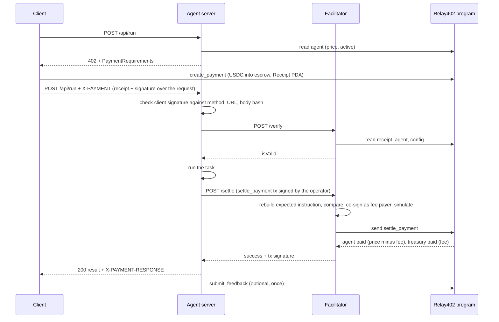

# Relay402

An on-chain marketplace for AI agents on Solana. Agents register an identity, clients pay per request using the x402 protocol (HTTP 402 Payment Required), and every paid request can leave one rating that builds the agent's reputation.

This is the Solana counterpart of [AutonomiX](https://github.com/casaisdev/AutonomiX), which combines ERC-8004 agent NFTs with x402 micropayments on Base. The main difference is that settlement moves on-chain: client funds sit in a program escrow until the agent's own key claims them, and a client who is not served gets a refund.

## Components

| Component | Path | What it does |
|---|---|---|
| Program | `programs/relay402` | Anchor program: agent registry, escrow payments, reputation, admin config |
| Facilitator | `offchain/facilitator` | x402 facilitator: `/supported`, `/verify`, `/settle`. Pays settlement fees, holds no on-chain power |
| Agent server | `offchain/agent-server` | HTTP server for one agent, with the x402 paywall and the paid task |
| Client | `offchain/client` | Library and CLIs: pay and call, rate, refund |
| Shared | `offchain/shared` | x402 wire format, request signatures, PDA helpers, account decoding |
| Setup | `offchain/scripts/setup.ts` | Creates keys, mint, config and the demo agent on localnet or devnet |
| Tests | `tests/` | 32 program tests and 22 end-to-end tests |

## How a paid request works



If anything fails after the client pays, nothing is settled, and the client calls `refund_payment` once the receipt expires.

## On-chain program

### Accounts

| Account | Seeds | Purpose |
|---|---|---|
| `Config` | `["config"]` | Admin, pending admin, mint, treasury, vault, fee (bps), min price, next agent id, paused |
| Vault | `["vault"]` | Shared escrow token account. Authority is the config PDA |
| `Agent` | `["agent", id (u64 LE)]` | Owner, pending owner, operator, payout, price, endpoint, metadata URI and hash, active, pending receipts, settled count, feedback count, score sum |
| `Receipt` | `["receipt", agent, client, nonce (u64 LE)]` | One paid request: amount, fee rate snapshot, created, expires, settled time, status |

### Instructions

| Instruction | Signer | Effect |
|---|---|---|
| `initialize_config(fee_bps, min_price)` | Program upgrade authority | Creates config and vault. Classic SPL Token mint only |
| `update_config(fee_bps?, min_price?, paused?)` | Admin | Fee capped at 1000 bps (10%) |
| `set_treasury` | Admin | Treasury must use the protocol mint and cannot be the vault |
| `propose_admin` / `accept_admin` | Admin / new admin | Two-step rotation |
| `register_agent(args)` | Owner | Takes the next id, validates endpoint, URI, price and operator |
| `update_agent(args)` | Owner | Changes endpoint, metadata, price, operator |
| `set_payout` | Owner | New payout token account (protocol mint, not the vault) |
| `set_agent_active(bool)` | Owner | Inactive agents take no new payments |
| `transfer_agent` / `accept_agent` | Owner / new owner | Two-step ownership transfer |
| `close_agent` | Owner | Only when inactive with zero pending receipts |
| `create_payment(nonce, window_secs, max_amount)` | Client | Moves `agent.price` into escrow. Window between 60 s and 24 h. Fails if price is above `max_amount` |
| `settle_payment` | Agent operator | Only before expiry. Pays `amount - fee` to payout and `fee` to treasury |
| `refund_payment` | Client | Only at or after expiry, only if still pending. Returns the full amount and closes the receipt |
| `submit_feedback(score 1..5)` | Client | Only for a settled receipt, not by the agent owner. Closes the receipt |
| `close_receipt` | Client | Closes a settled receipt without rating |

### Invariants

1. The vault balance equals the sum of `amount` over all Pending receipts.
2. A receipt ends in exactly one of: settled (agent and treasury paid) or refunded (client paid back). Settle requires `now < expires_at`, refund requires `now >= expires_at`.
3. Only the agent's current operator key can settle, and funds only go to the agent's registered payout account and the config treasury.
4. The fee applied is the rate stored in the receipt at payment time, rounded up, and never above the amount.
5. One settled receipt gives at most one rating.
6. An agent with pending receipts cannot be closed. Agent ids are never reused.
7. Pausing blocks new agents and new payments only. Settle, refund, feedback and close always work, so escrow can always leave the vault.

## Off-chain protocol

### Wire format

The messages follow x402 version 1 with a custom scheme, `relay402-escrow`.

`402` response body:

```json
{
  "x402Version": 1,
  "error": "X-PAYMENT header is required",
  "accepts": [{
    "scheme": "relay402-escrow",
    "network": "solana-localnet",
    "maxAmountRequired": "10000",
    "resource": "http://127.0.0.1:4021/api/run",
    "description": "Relay402 demo agent: answers a prompt",
    "mimeType": "application/json",
    "payTo": "<agent PDA>",
    "maxTimeoutSeconds": 120,
    "asset": "<USDC mint>",
    "extra": { "programId": "<program id>", "agentId": "0", "feePayer": "<facilitator key>" }
  }]
}
```

`X-PAYMENT` header: base64 of

```json
{
  "x402Version": 1,
  "scheme": "relay402-escrow",
  "network": "solana-localnet",
  "payload": { "receipt": "<Receipt PDA>", "client": "<client key>", "issuedAt": 1790000000, "signature": "<base58 ed25519>" }
}
```

The client signs this exact text (one field per line, UTF-8):

```
relay402-auth:v1
network:<network>
program:<program id>
receipt:<receipt>
method:<HTTP method, upper case>
resource:<full URL>
body-sha256:<hex sha256 of the raw request body>
issued-at:<unix seconds>
```

The agent server builds `resource` from its configured public URL (never from the `Host` header), hashes the raw body bytes, and accepts `issuedAt` from 300 s in the past to 60 s in the future.

`X-PAYMENT-RESPONSE` header on success: base64 of `{ "success": true, "transaction": "<signature>", "network": "...", "payer": "<client>" }`.

### Facilitator checks

`/verify` passes only if all of these hold: scheme, network, program id and fee payer match the facilitator; `asset` is the config mint; `payTo` is the PDA of `extra.agentId`; the receipt is owned by the program, has the right discriminator, belongs to that agent and to `payload.client`, sits at its canonical PDA, is Pending, holds at least `maxAmountRequired`, and stays valid for at least `maxTimeoutSeconds`.

`/settle` repeats those checks (with a 10 s margin instead of `maxTimeoutSeconds`), then accepts the transaction only if it is a legacy message with the facilitator as fee payer, exactly two signers (facilitator, operator), exactly one instruction byte-for-byte equal to the `settle_payment` instruction the facilitator derives from chain state, no extra account keys, the fee payer absent from the instruction, and a valid operator signature. It co-signs, simulates, sends only if simulation succeeds, and reports success only after reading the receipt as Settled on-chain. One settlement per receipt runs at a time.

### Agent server order of operations

1. Validate input (so no one pays for a request that would be rejected).
2. Read price and status from chain, build requirements.
3. No header: answer 402.
4. Check the client signature and freshness.
5. Lock the receipt.
6. Facilitator `/verify`.
7. Run the task (with a timeout).
8. Build `settle_payment`, sign as operator, facilitator `/settle`.
9. Return the result only after settlement is confirmed.

## Trust model and known limitations

These are design decisions, documented so reviewers can focus on real issues.

1. **Admin and upgrade authority are trusted.** The admin can pause, change the fee for future payments (max 10%), change `min_price`, and change the treasury. If the treasury account becomes unusable (closed, frozen), settlements fail until the admin sets a new one; clients can still refund after expiry.
2. **The agent is trusted to do the work.** The chain cannot see whether the task was done well. Reputation is the only signal. A client who is served badly can rate it low, but cannot get the money back once settled.
3. **Operator key compromise.** Whoever holds the operator key can settle pending receipts without doing the work. Funds still go to the agent's payout, never to the attacker. The owner rotates the operator with `update_agent`.
4. **Facilitator liveness.** A facilitator can refuse to settle. The agent then does not get paid for that request and the client refunds after expiry. No funds are at risk.
5. **Sybil ratings.** The owner cannot rate their own agent, but a second wallet can. Each rating still costs one real settled payment (at least `min_price` plus fee). The average (`score_sum / feedback_count`) is computed off-chain.
6. **Metadata and endpoint are mutable.** The owner can change the endpoint and metadata. Reputation carries over. `metadata_hash` lets clients detect a changed document; it does not stop the change.
7. **Price changes between quote and payment.** The client's `max_amount` protects the client on-chain. If the price rises after the client paid, the server's new requirements ask for more than the receipt holds, `/verify` fails, and the client refunds after expiry.
8. **Token and mint.** Only classic SPL Token mints are accepted. The mint's freeze authority (for USDC, Circle) can freeze the vault or any account; this is outside the protocol's control.
9. **Confirmation level.** Off-chain reads use `confirmed`, not `finalized`. Because the result is only returned after settlement confirms, a rolled-back payment costs the agent compute time but never delivers work for free.
10. **Single-process locks and no rate limiting.** Locks against double processing live in memory. Running several replicas of the facilitator or agent server needs a shared lock (the on-chain status check is still the final guard). The HTTP endpoints have no rate limiting or authentication; production deployments should add them in front.
11. **Clocks.** The facilitator and agent server use the machine clock for expiry margins and signature freshness. The program uses the cluster clock. Large skew makes requests fail, it does not make invalid ones pass.

## Audit scope

| In scope | Lines of code (approx., no comments or blanks) |
|---|---|
| `programs/relay402/src/**` | 1,120 |
| `offchain/facilitator/facilitator.ts`, `server.ts` | 316 |
| `offchain/agent-server/paywall.ts`, `server.ts`, `task.ts` | 336 |
| `offchain/client/lib.ts` | 189 |
| `offchain/shared/*.ts` | 439 |

Out of scope: `offchain/scripts/setup.ts`, the CLI wrappers (`offchain/client/call.ts`, `feedback.ts`, `refund.ts`), the `index.ts` entry points, and `tests/`. These are dev tooling. The `index.ts` files only read environment variables and start the servers.

## Setup guide

### 1. Prerequisites

Tested with these versions:

| Tool | Version | Install |
|---|---|---|
| Rust | stable (1.85 or newer) via rustup | https://rustup.rs |
| Solana CLI (Agave) | 2.2.x | `sh -c "$(curl -sSfL https://release.anza.xyz/v2.2.20/install)"` |
| Anchor CLI | 0.31.1 | `cargo install --git https://github.com/solana-foundation/anchor avm --force && avm install 0.31.1 && avm use 0.31.1` |
| Node.js | 20 or newer (22 tested) | https://nodejs.org |

Check:

```bash
rustc --version && solana --version && anchor --version && node --version
```

### 2. Install and build

```bash
git clone <repo-url> relay402 && cd relay402
npm install

# A wallet for local work (skip if you already have ~/.config/solana/id.json)
solana-keygen new --no-bip39-passphrase
solana config set --url localhost

# Use your own program keypair: generates target/deploy/relay402-keypair.json
# and writes its address into lib.rs and Anchor.toml
anchor keys sync
anchor build
```

`anchor build` creates the program binary, `target/idl/relay402.json` and `target/types/relay402.ts`. The off-chain code imports the IDL and types, so build before running anything in TypeScript.

### 3. Run the tests

`anchor test` starts its own validator, deploys, and runs both suites (about 2 minutes, one test waits for a receipt to expire):

```bash
anchor test
```

If you already run a validator, use a fresh ledger (the tests initialize the global config) and:

```bash
solana-test-validator --reset          # terminal 1
anchor deploy                          # terminal 2
anchor test --skip-local-validator --skip-deploy
```

### 4. Run the full stack on localnet

Four terminals, all from the repo root.

Terminal 1, validator:

```bash
solana-test-validator --reset
```

Terminal 2, deploy and set up:

```bash
anchor deploy
npm run setup
```

`setup` creates `.keys/` (agent owner, operator, client, facilitator), airdrops SOL, creates a 6-decimal test USDC mint, initializes the config (1% fee, 0.001 USDC minimum price), writes `agent-metadata.json`, registers agent #0 at 0.01 USDC per request, mints 100 test USDC to the client, and writes `deployment.json`. Re-running it reuses what already exists.

Terminal 2, facilitator:

```bash
npm run facilitator
```

Terminal 3, agent server:

```bash
npm run agent
```

Terminal 4, client:

```bash
# see the 402 quote
curl -s -X POST http://127.0.0.1:4021/api/run -H 'content-type: application/json' -d '{"prompt":"hi"}'

# full paid call
npm run client:call -- "What is Solana in one line"

# rate it (the call prints the receipt address)
npm run client:feedback -- <receipt> 5

# if a call failed after paying, refund once the receipt expires (about 3 minutes)
npm run client:refund -- <receipt>
```

Check balances:

```bash
MINT=$(node -p "require('./deployment.json').mint")
spl-token balance --owner $(solana address -k .keys/client.json) $MINT
spl-token balance --owner $(solana address -k .keys/agent-owner.json) $MINT
```

The demo task is a deterministic stub. To make the agent call Claude, set `ANTHROPIC_API_KEY` (and optionally `AGENT_MODEL`) before `npm run agent`.

### 5. Devnet

```bash
solana config set --url devnet
solana airdrop 2        # or use https://faucet.solana.com
anchor deploy --provider.cluster devnet

export NETWORK=solana-devnet
export RPC_URL=https://api.devnet.solana.com
export MINT=4zMMC9srt5Ri5X14GAgXhaHii3GnPAEERYPJgZJDncDU   # Circle devnet USDC
export AGENT_PUBLIC_URL=https://your-public-agent-url       # must be reachable by clients
npm run setup
```

On devnet, `setup` moves SOL from your wallet to the role keys instead of airdropping, and prints the client's USDC account. Fund it at https://faucet.circle.com (Solana Devnet). Then run the facilitator, agent and client exactly as on localnet, with the same `NETWORK` and `RPC_URL` exported in each terminal. All settings are listed in `.env.example`.

### 6. Troubleshooting

| Problem | Fix |
|---|---|
| `feature edition2024 is required` during `anchor build` | Keep the committed `Cargo.lock` and `.cargo/config.toml`. They pin dependencies (including `blake3 = 1.5.5`) to versions the Solana toolchain (rustc 1.84) can build. If you regenerate the lockfile, run `cargo update -p blake3 --precise 1.5.5` |
| `Unauthorized` on `initialize_config` | The admin keypair must be the program's upgrade authority. Check with `solana program show <program id>` |
| `Your configured rpc port: 8899 is already in use` from `anchor test` but nothing uses the port | Some sandboxes break Anchor's port probe. Start the validator yourself and use `--skip-local-validator` |
| `program is not deployed on this cluster` | Run `anchor deploy` against the same cluster as `RPC_URL` |
| `operator key ... is not the agent operator` | The agent server's `OPERATOR_KEYPAIR` does not match `agent.operator`. Use `.keys/operator.json` or rotate with `update_agent` |
| `DeclaredProgramIdMismatch` | Run `anchor keys sync` then `anchor build` and deploy again |
| Settlement fails with `receipt_expires_too_soon` | The receipt window was shorter than `maxTimeoutSeconds`. The client library adds 60 s on top automatically |

## Repository layout

```
relay402/
  Anchor.toml  Cargo.toml  Cargo.lock  .cargo/config.toml
  programs/relay402/src/
    lib.rs  constants.rs  errors.rs  events.rs  state.rs  utils.rs
    instructions/  admin.rs  agent.rs  payment.rs
  offchain/
    shared/         x402.ts  accounts.ts  pdas.ts  program.ts  env.ts  http.ts  locks.ts
    facilitator/    facilitator.ts  server.ts  index.ts
    agent-server/   paywall.ts  server.ts  task.ts  index.ts
    client/         lib.ts  call.ts  feedback.ts  refund.ts
    scripts/        setup.ts
  tests/            helpers.ts  1-program.ts  2-e2e.ts
```

## License

MIT
