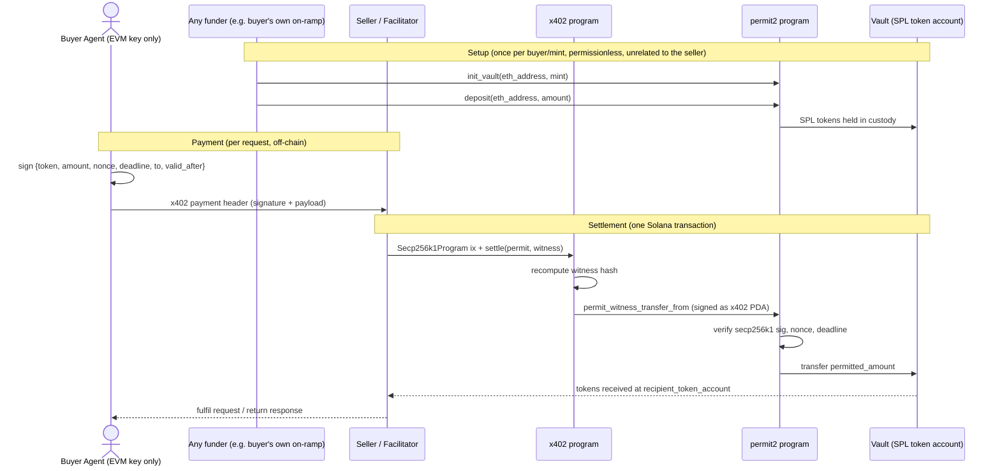

# x402-Meridian

A Solana settlement layer for the [x402](https://www.x402.org/) agentic payment
protocol, built so that **agentic buyers who only hold an EVM wallet can pay
sellers that only exist on Solana** — without the buyer ever touching a Solana
keypair, submitting a Solana transaction, or paying gas on either chain.

## Why this exists

x402 lets an AI agent pay for an API call or a resource by attaching a signed
payment authorization to an HTTP request instead of a wallet-based checkout flow.
On EVM, that authorization is a signature the seller's facilitator can redeem
on-chain on the buyer's behalf. The gap this project closes: **an EVM-only agent
has no way to satisfy a Solana-only seller**, because it has no SPL token account,
no Solana keypair, and no way to sign a Solana transaction — it only knows how to
produce a secp256k1 (Ethereum-style) signature.

x402-Meridian is two Anchor programs that make that signature alone sufficient:

- an EVM address becomes a first-class fund owner on Solana, custodying SPL
  tokens in a program-controlled vault instead of a wallet it can't have, and
- a single secp256k1 signature — verified on-chain via Solana's native
  `Secp256k1Program` precompile — is all that's needed to authorize moving those
  funds to a seller, with no Solana transaction ever signed by the buyer.

The seller (or their facilitator) is the only party that ever submits a Solana
transaction. The buyer's agent only ever produces one off-chain ECDSA signature.

## Architecture

The system is two cooperating Anchor programs, each with a distinct
responsibility.

### `permit2` — the custody & signature-authorization layer

Modeled directly on Uniswap's [Permit2](https://github.com/Uniswap/permit2) (`SignatureTransfer.sol`), reimplemented for a chain where the fund owner cannot
hold a native account.

- **Vault-per-EVM-address custody.** Since an Ethereum address cannot own an SPL
  token account or grant an SPL delegate approval, `permit2` holds the tokens
  itself. Any Ethereum address can have a vault created for any SPL mint
  (`init_vault`), and _anyone_ may deposit into that vault on the owner's behalf
  (`deposit`) — depositing is permissionless, exactly like sending someone tokens
  on EVM doesn't require their signature. In practice this funding is the
  buyer's own concern (e.g. their own on/off-ramp) and is unrelated to any
  particular seller — the seller never deposits into a buyer's vault.
- **Signature-gated withdrawal.** Moving funds _out_ of a vault requires a
  secp256k1 signature from the exact Ethereum address that owns it. The signer
  commits to `{token, amount, nonce, deadline}` plus a destination — this program
  never moves more than what was explicitly signed for, and never to a
  destination the signature didn't commit to.
- **Unordered nonces.** Rather than requiring signatures to be redeemed in
  strict sequence, `permit2` uses the same bitmap-nonce scheme as EVM Permit2: a
  `u64` nonce space per Ethereum address, tracked in 256-nonce-wide bitmap
  "words." This lets a buyer's agent sign several payments without coordinating
  their order, and lets multiple signed payments be settled asynchronously and
  out of order, exactly as EVM Permit2 allows.

### `x402` — the settlement gateway

The program a seller's facilitator actually calls. It is a thin, permissionless
wrapper around `permit2`, mirroring `x402ExactPermit2Proxy.settle` from the EVM
reference implementation.

- The buyer's agent signs a payment authorization **plus a witness** — a
  `{to, valid_after}` struct binding the payment to a specific recipient and
  earliest-valid time — off-chain, and hands it to the seller as the x402
  payment header.
- The seller (or a facilitator acting for them) submits one Solana transaction
  containing the `Secp256k1Program` signature-verification instruction followed
  by `x402::settle`.
- `settle` re-derives the witness hash, then calls into `permit2` **as its own
  program-owned signing authority** (a PDA), the direct analogue of the proxy
  contract's own address being the authorized `spender` on EVM. `permit2`
  independently re-verifies the signature, the nonce, and the deadline — the
  facilitator has no discretion over amount, recipient, or timing.
- Once `permit2` confirms the transfer, funds land directly in the seller's
  token account and the seller can fulfill the request / return a response to
  the buyer's agent.

### Execution flow



## Installation

This project uses [Anchor](https://www.anchor-lang.com/) — you need the Solana
CLI and Anchor CLI installed in addition to Rust, not just `cargo`.

### Prerequisites

1. **Rust** (stable toolchain)

   ```bash
   curl --proto '=https' --tlsv1.2 -sSf https://sh.rustup.rs | sh
   ```

2. **Solana CLI** (provides `solana`, `solana-keygen`, and the `cargo build-sbf`
   toolchain Anchor needs to produce a deployable on-chain binary)

   ```bash
   sh -c "$(curl -sSfL https://release.anza.xyz/stable/install)"
   solana --version
   ```

3. **Anchor CLI**, via [AVM](https://www.anchor-lang.com/docs/installation)
   (the Anchor version manager) — pin it to the version this repo targets:

   ```bash
   cargo install --git https://github.com/coral-xyz/anchor avm --locked --force
   avm install 0.32.1
   avm use 0.32.1
   anchor --version
   ```

4. **Node.js + a package manager** (for the TypeScript test suite)

   ```bash
   npm install -g yarn   # or use npm directly
   ```

### Setup

```bash
git clone <this-repo>
cd solana

# Install JS/TS dependencies for the Anchor test suite
yarn install   # or: npm install

# Point the Solana CLI at a local validator / devnet as needed
solana config set --url localhost   # or --url devnet

# Build both programs (compiles Rust -> SBF, produces target/deploy/*.so + IDLs)
anchor build
```

### Running the tests

```bash
anchor test
```

This spins up a local validator, deploys both programs, and runs
`tests/x402_permit2.ts`, which walks the full flow end-to-end using a raw
Ethereum private key (via `ethers`) as the buyer — no Solana keypair ever stands
in for the buyer's identity.

### Program IDs (localnet)

| Program   | Address                                        |
| --------- | ---------------------------------------------- |
| `permit2` | `AMgFk2AaifYzL9Tre3ZSFgTvgG2f8da44pFCuf7tjDSY` |
| `x402`    | `143GL29Krnj2RzAwRUuSatBek5tiQKxh2YPw2ByeMcwW` |

If you regenerate the deploy keypairs under `target/deploy/`, update both
`declare_id!` calls in the programs' `lib.rs` files and the
`[programs.localnet]` section of `Anchor.toml` to match.

## Scope

All on-chain program logic lives under `programs/`, split into the two crates
described above:

```
programs/
├── permit2/
│   └── src/
│       ├── lib.rs            # program entrypoints: init_vault, deposit,
│       │                     #   permit_transfer_from, permit_witness_transfer_from,
│       │                     #   invalidate_unordered_nonces, close_nonce_bitmap
│       ├── context.rs        # #[derive(Accounts)] structs for every instruction
│       ├── instructions.rs   # shared transfer body + unordered-nonce primitive
│       ├── crypto.rs         # keccak256 hashing + secp256k1 precompile verification
│       ├── state.rs          # on-chain accounts: Vault, NonceBitmap
│       ├── events.rs         # emitted events (Deposited, PermitTransferExecuted, ...)
│       └── errors.rs         # Permit2Error variants
│
└── x402/
    └── src/
        ├── lib.rs            # program entrypoint: settle
        ├── context.rs        # #[derive(Accounts)] struct for Settle
        ├── crypto.rs         # witness hashing
        ├── state.rs          # Witness struct + settlement-authority PDA seed
        ├── events.rs         # emitted events (Settled)
        └── errors.rs         # X402Error variants
```
